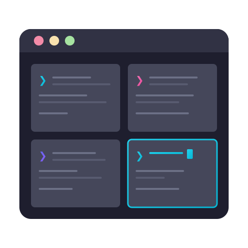

<p align="center">
  
</p>

<h1 align="center">Shellify</h1>

<p align="center">
  <strong>Terminal multiplexer session manager for tmux and zellij</strong>
</p>

<p align="center">

[](https://github.com/ajmasia/shellify/actions/workflows/ci.yml)
[](https://github.com/ajmasia/shellify/actions/workflows/release.yml)
[](https://github.com/ajmasia/shellify/releases/latest)
[](https://www.gnu.org/licenses/gpl-3.0)
[](https://golang.org/)
[](https://reactjs.org/)
[](https://www.typescriptlang.org/)

</p>

---

## About

Shellify is a session manager for terminal multiplexers (tmux and zellij). It allows you to define, save, and launch complex terminal layouts with multiple windows and panes, organized by projects.

**Key Features:**

- Organize sessions by projects
- Support for tmux and zellij
- Visual session editor (GUI)
- Interactive CLI with shell completions
- Launch, attach, and stop sessions
- Clone and duplicate sessions
- JSON-based portable configuration

## Installation

### From Releases (Recommended)

Download the latest release for your platform from [GitHub Releases](https://github.com/ajmasia/shellify/releases/latest).

#### Debian/Ubuntu (.deb)

```bash
# Download and install (amd64)
curl -LO https://github.com/ajmasia/shellify/releases/latest/download/shellify_amd64.deb
sudo dpkg -i shellify_amd64.deb

# Or for arm64
curl -LO https://github.com/ajmasia/shellify/releases/latest/download/shellify_arm64.deb
sudo dpkg -i shellify_arm64.deb
```

#### Manual Installation (tar.gz)

```bash
# Linux (amd64)
curl -LO https://github.com/ajmasia/shellify/releases/latest/download/shellify_linux_amd64.tar.gz
tar -xzf shellify_linux_amd64.tar.gz
sudo mv sfy /usr/local/bin/

# Linux (arm64)
curl -LO https://github.com/ajmasia/shellify/releases/latest/download/shellify_linux_arm64.tar.gz
tar -xzf shellify_linux_arm64.tar.gz
sudo mv sfy /usr/local/bin/

# macOS (Intel)
curl -LO https://github.com/ajmasia/shellify/releases/latest/download/shellify_darwin_amd64.tar.gz
tar -xzf shellify_darwin_amd64.tar.gz
sudo mv sfy /usr/local/bin/

# macOS (Apple Silicon)
curl -LO https://github.com/ajmasia/shellify/releases/latest/download/shellify_darwin_arm64.tar.gz
tar -xzf shellify_darwin_arm64.tar.gz
sudo mv sfy /usr/local/bin/
```

### From Source

```bash
git clone https://github.com/ajmasia/shellify.git
cd shellify
make build
sudo mv bin/sfy /usr/local/bin/
```

### NixOS / Nix

Shellify provides a Nix flake for installation on NixOS or any system with Nix.

#### Using nix profile (imperative)

```bash
nix profile install github:ajmasia/shellify
```

#### Using nix run (try without installing)

```bash
nix run github:ajmasia/shellify -- --help
```

#### NixOS configuration (declarative)

Add to your `flake.nix` inputs:

```nix
{
  inputs = {
    nixpkgs.url = "github:NixOS/nixpkgs/nixos-unstable";
    shellify.url = "github:ajmasia/shellify";
  };
}
```

Then in your `configuration.nix`:

```nix
{ inputs, pkgs, ... }:
{
  environment.systemPackages = [
    inputs.shellify.packages.${pkgs.system}.default
  ];
}
```

#### Home Manager (module)

Add the module to your home-manager imports:

```nix
# In flake.nix
{
  inputs = {
    home-manager.url = "github:nix-community/home-manager";
    shellify.url = "github:ajmasia/shellify";
  };
}

# In your home configuration
{ inputs, ... }:
{
  imports = [ inputs.shellify.homeManagerModules.default ];

  programs.shellify.enable = true;
}
```

#### Home Manager (manual)

```nix
{ inputs, pkgs, ... }:
{
  home.packages = [
    inputs.shellify.packages.${pkgs.system}.default
  ];
}
```

#### Using the overlay

```nix
{
  nixpkgs.overlays = [ inputs.shellify.overlays.default ];

  # Then use it as a regular package
  environment.systemPackages = [ pkgs.shellify ];
}
```

The Nix package includes CLI with embedded GUI and shell completions for bash, zsh, and fish.

### Uninstall

```bash
# If installed via .deb
sudo apt remove shellify

# If installed manually
sudo rm /usr/local/bin/sfy

# Optional: remove configuration
rm -rf ~/.config/shellify
```

## Quick Start

```bash
# Create a project
sfy project create my-project

# Create a session
sfy session create dev -p my-project

# Edit session layout (GUI)
sfy session edit dev --gui

# Launch session
sfy session launch dev
```

## Usage

### Projects

```bash
sfy project list                    # List all projects
sfy project create [name]           # Create project (interactive if no name)
sfy project get <name>              # Show project details
sfy project update <name>           # Update project
sfy project delete <name>           # Delete project
```

### Sessions

```bash
sfy session list [-p project]       # List sessions
sfy session create [-p project]     # Create session
sfy session get <name>              # Show session details
sfy session edit <name> --gui       # Visual editor
sfy session clone <name>            # Clone session
sfy session delete <name>           # Delete session

sfy session launch <name>           # Launch session
sfy session attach <name>           # Attach to running session
sfy session stop <name>             # Stop session
sfy session status <name>           # Check session status
```

### Server & GUI

```bash
sfy server                          # Start HTTP server
sfy server stop                     # Stop server
sfy server status                   # Check server status
```

### Shell Completions

```bash
# Bash
sfy completion bash > /etc/bash_completion.d/sfy

# Zsh
sfy completion zsh > "${fpath[1]}/_sfy"

# Fish
sfy completion fish > ~/.config/fish/completions/sfy.fish
```

For more details, run `sfy --help` or `sfy <command> --help`.

## Configuration

Shellify follows the [XDG Base Directory Specification](https://specifications.freedesktop.org/basedir-spec/basedir-spec-latest.html).

### Data Location

```
~/.config/shellify/
├── config.json                    # Application settings
└── projects/
    └── <project-id>/
        ├── project.json           # Project metadata
        └── sessions/
            └── <session-id>.json  # Session configuration
```

### Configuration File

The `config.json` file stores application settings:

```json
{
  "defaultMultiplexer": "tmux",
  "defaultShell": "/bin/bash"
}
```

## Development

### Prerequisites

- Go 1.24+
- Node.js 22+ (for GUI)
- tmux or zellij (for testing)
- golangci-lint (for linting)
- goreleaser (for releases)

### Setup with Nix (Recommended)

The project includes a Nix flake that provides both a **development shell** and a **package build**.

```bash
# Clone repository
git clone https://github.com/ajmasia/shellify.git
cd shellify

# Enter development shell (includes all dependencies)
nix develop

# Or run commands directly
nix develop -c make build
nix develop -c make test
nix develop -c make lint
```

The development shell (`nix develop`) provides:
- Go 1.24 (matches go.mod toolchain)
- Node.js 22 (for GUI development)
- goreleaser
- tmux and zellij (for testing)
- gnumake

The package build (`nix build .#shellify`) creates a fully compiled binary with embedded GUI, ready for distribution.

### Manual Setup

```bash
# Clone repository
git clone https://github.com/ajmasia/shellify.git
cd shellify

# Install dependencies
go mod download
cd gui && npm ci && cd ..

# Build
make build           # CLI only
make build-with-gui  # CLI with embedded GUI
```

### Development Mode

```bash
# Terminal 1: Start API server
make run ARGS="server --static gui/dist"

# Terminal 2: Start GUI dev server
make gui-dev
```

### Testing

```bash
make test       # Run Go tests
make lint       # Run linter
make gui-check  # Run GUI lint and typecheck
```

## Contributing

Contributions are welcome! Please read our [Contributing Guide](CONTRIBUTING.md) for details on our code of conduct and the process for submitting pull requests.

## License

This project is licensed under the GNU General Public License v3.0 - see the [LICENSE](LICENSE) file for details.

---

<p align="center">
  Made with <span style="color: #e25555;">&#9829;</span> using Go and React
</p>
